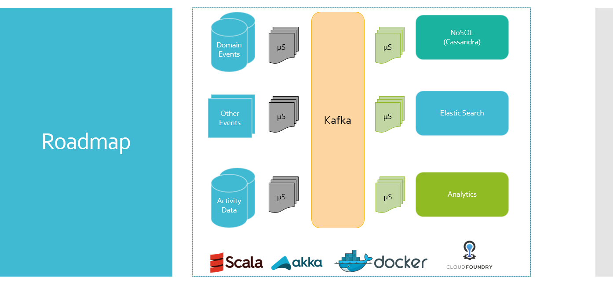

# Building Distributed Data Engineering Applications (Scala Edition)
This is a 10 day instructor led or online self-learning immersion bootcamp to build job-ready skills to build modern distributed data engineering applications using Scala and tools/frameworks in the eco-system.

### Prerequisites
* Experience with a programming language is preferred
* Work experience with distributed systems, data processing and/or streaming systems is preferred

### Key Concepts
These are the key concepts and skills that trainees will learn and master by building best practices driven distributed data engineering applications.
* Functional Programming
* Distributed Systems
* Micro-services
* NoSQL
* DevOps
* Cloud

### Program Outline
The following a list of topic modules covered in this program.
* Introduction
* Essentials of Scala
* Object Oriented Programming with Scala
* Functional Programming with Scala
* Fundamentals of Distributed Systems
* Kafka
* MicroServices
* Akka
* Docker
* Cassandra
* REST
* Akka HTTP
* Akka Streams
* Elastic Search
* DevOps for Scala Developers
* Final Project for Scala Developers
* Next Steps for Scala Developers

### Capstone Distributed Data Processing System
As part of the training program, trainees will build an end-to-end distributed data processing solution. Trainees will build 4 different Micro-Services based applications using Akka to ingest data from a variety of data sources to Kafka, process data and publish to Elastic Search for consumption.

### Software/Tools
* [JDK 8](http://www.oracle.com/technetwork/java/javase/downloads/jdk8-downloads-2133151.html)
* [SBT](http://www.scala-sbt.org/)
* [Intellij IDEA](https://www.jetbrains.com/idea/download)
* [Github Desktop](https://desktop.github.com/)
* [Docker Toolbox](https://www.docker.com/products/docker-toolbox)
* [Oracle Virtualbox](https://www.virtualbox.org/)
* [Postman](https://www.getpostman.com/)
